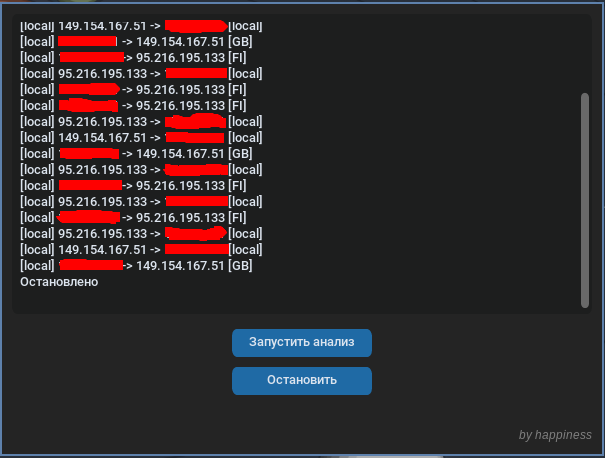

# Net-Watch-Geo
Современный сетевой сниффер с отслеживанием Geo-IP в реальном времени и поддержкой VPN-туннелей



---

##  🛠 Технический стек
Язык: Python 3.10+

Интерфейс: customtkinter (Modern Dark Theme)

Сеть: scapy (Packet manipulation)

Геолокация: geoip2 + база данных GeoLite2-Country.mmdb

---

## Инструкция для Linux (CachyOS, Arch, Ubuntu, Debian)

### 1. Установка системных компонентов
Если в вашей системе не установлен менеджер пакетов `pip`, выполните команду:
```bash
# Для Arch / CachyOS:
sudo pacman -S python-pip
```
```bash
# Для Ubuntu / Debian:
sudo apt update && sudo apt install python3-pip
```

### 2. Установка библиотек
Используйте файл зависимостей. В современных дистрибутивах необходимо использовать флаг --break-system-packages
```bash
pip install -r requirements.txt --break-system-packages
```

### 3. Настройка интерфейса
Перед запуском проверьте название вашего сетевого интерфейса командой ip addr.

Откройте файл sniffer.py и в функции sniff укажите нужный интерфейс.

Пример для VPN (Nekoray): iface="neko-tun"

Пример для Wi-Fi: iface="wlan0"


### 4. Запуск
Для работы с сетевым интерфейсом требуются права суперпользователя:
```bash
sudo python main.py
```

## Инструкция для Windows

### 1. Установка драйвера (Обязательно)
Для захвата пакетов в Windows необходимо установить драйвер Npcap:

Скачайте его с официального сайта: https://npcap.com/#download

При установке обязательно выберите галочку: "Install Npcap in WinPcap API-compatible Mode".


### 2. Установка библиотек
Запустите командную строку (CMD) или PowerShell от имени администратора и выполните:
```powershell
pip install -r requirements.txt
```


### 3. Запуск
Программу необходимо запускать в терминале с правами администратора:
```powershell
python main.py
```

## Если при запуске у вас ошибка, то отредактируйте файл sniffer.py, в 37 строку уберите iface="neko-tun", и запустите еще раз

---

**Created by happiness** | ⚖️ Этот инструмент создан только в учебных целях. Используйте его ответственно
